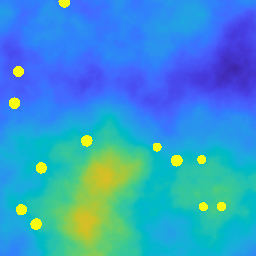
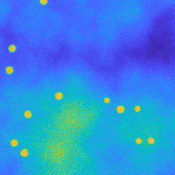
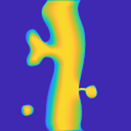
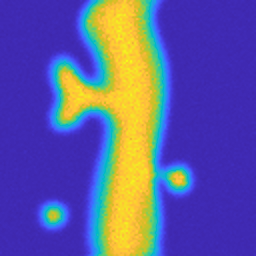
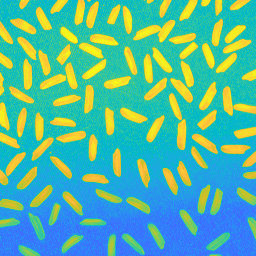
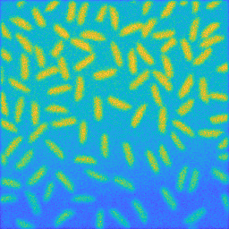

# DDIPP

### Double Deep Image Prior for Poisson noise
---
Matlab code of the PGDA approach described in 

Benfenati A., Catozzi A., Ruggiero V., _Neural Blind Deconvolution with Poisson Data_, **Inverse Problems**, 39, 054003, [link](10.1088/1361-6420/acc2e0)

---

### Running the Code

The demo file Main.m sets the algorithm's parameters for solving the blind deconvolution problem as described in the paper. A brief description of the files is given.

 - Main.m 		: Demo file. It runs the entire procedure
 - DDIPP_UNET.m  	: Creates the UNET network used for the image restoration
 - SIREN.m : Creates the SIREN network for the recostruction of the Point Spread Function (PSF)
 - lagrangian_TotVar.m : Implements the loss function of the training
 - TV_dlarrayPGDA.m 	: Implements the Total Variation functional
 - NetInit.m 		: Initialization of the networks
 - lossTrainNet.m	: loss function for the initialization of the networks
 - softThresh.m 	: Implenents the soft threshodling operator 
 - projectDF.m 	: Implemets the projection for the PSF (more documentation available [here](https://www.unife.it/prin/software), under in SGP-dec.tgz repository
 - psfGauss.m 		: Initializes a Gaussian PSF of given dimension and standard deviation
 - loadData.m 		: Loads the data from a .mat file. Such file must contain the ground truths (obj and PSF), the blurred and noisy corrupted image (gn) and the parameter rho for the PSF
 - onlineVisualization.m : Routine for online visualization of the running results
 
 ---
 
### Datasets

|Image|PSF|gn|
|:---:|:----:|:----:|
||||
||||
||||

_Remark_: the above images have been modified for visualization purposes.

